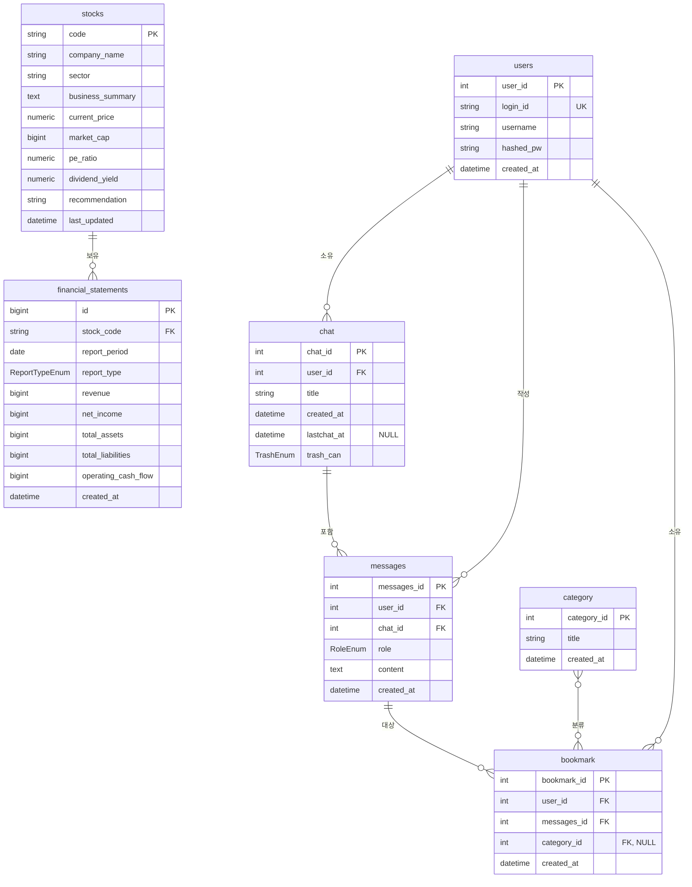

# DB diagram

## 재무제표 & chat diagram

```mermaid
erDiagram
    users {
        int user_id PK
        string login_id "UK"
        string username
        string hashed_pw
        datetime created_at
    }
    chat {
        int chat_id PK
        int user_id FK
        string title
        datetime created_at
        datetime lastchat_at "NULL"
        TrashEnum trash_can
    }
    messages {
        int messages_id PK
        int user_id FK
        int chat_id FK
        RoleEnum role
        text content
        datetime created_at
    }
    category {
        int category_id PK
        string title
        datetime created_at
    }
    bookmark {
        int bookmark_id PK
        int user_id FK
        int messages_id FK
        int category_id "FK, NULL"
        datetime created_at
    }
    stocks {
        string code PK
        string company_name
        string sector
        text business_summary
        numeric current_price
        bigint market_cap
        numeric pe_ratio
        numeric dividend_yield
        string recommendation
        datetime last_updated
    }
    financial_statements {
        bigint id PK
        string stock_code FK
        date report_period
        ReportTypeEnum report_type
        bigint revenue
        bigint net_income
        bigint total_assets
        bigint total_liabilities
        bigint operating_cash_flow
        datetime created_at
    }

    users ||--o{ chat : "소유"
    users ||--o{ messages : "작성"
    users ||--o{ bookmark : "소유"
    chat ||--o{ messages : "포함"
    messages ||--o{ bookmark : "대상"
    category }o--o{ bookmark : "분류"
    stocks ||--o{ financial_statements : "보유"
```
